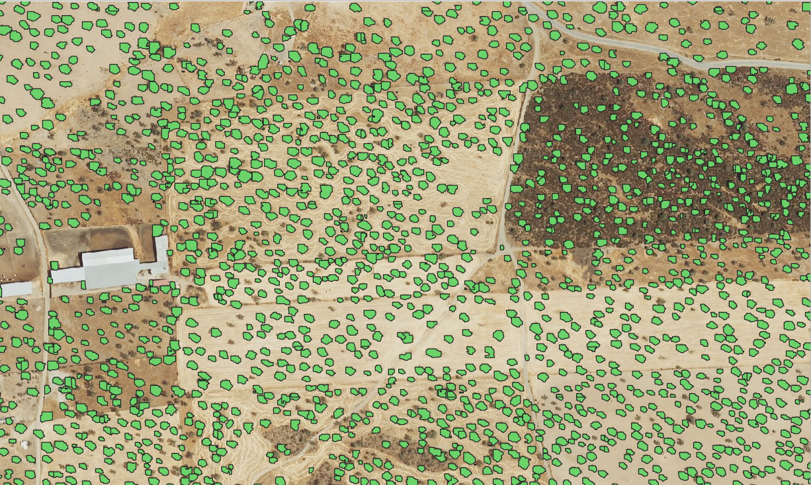
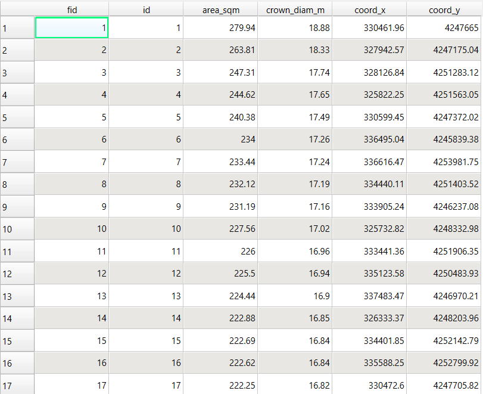
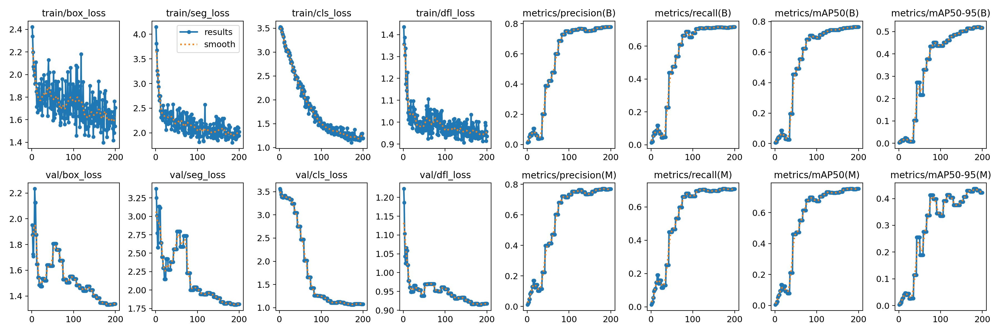
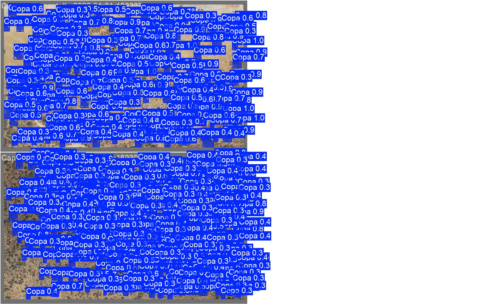

# Dehesa Tree Crown Segmentation (YOLOv11)


[](https://universe.roboflow.com/encinas/my-first-project-l5ltb/dataset/5)

Instance segmentation of individual tree crowns in Mediterranean Dehesa ecosystems. Processes large aerial orthophotos tile-by-tile and exports georeferenced crown polygons to GeoPackage for direct use in QGIS or ArcGIS.



---

## Features

| Capability | Description |
| :--- | :--- |
| **Out-of-core tiling** | Sliding-window sampler handles orthophotos of any size without loading the full image into RAM |
| **Instance segmentation** | YOLOv11n-seg produces a pixel-level mask for each individual crown |
| **Georeferencing** | Affine transform maps pixel masks to real-world CRS polygons, preserving the raster's coordinate reference system |
| **Spatial NMS** | Vectorised IoU-based duplicate suppression across tile boundaries using geopandas spatial join |
| **Per-tree biometrics** | Crown area (m²), estimated diameter (m), centroid coordinates (X/Y) |
| **Stand-level metrics** | Tree density (stems/ha), Fractional Canopy Cover (%), diameter statistics |
| **GIS export** | GeoPackage (.gpkg) compatible with QGIS and ArcGIS |

---

## How It Works

```
Orthophoto (.tif)
      │
      ▼
 TilingSampler ──► 960×960 px windows (configurable overlap)
      │
      ▼
 CrownDetectionEngine  ←── YOLOv11n-seg weights
      │  per tile: read → infer → mask-to-polygon (affine)
      │  parallel threads, each with its own rasterio handle
      │
      ▼
 Vectorised NMS  (spatial join + IoU threshold)
      │
      ▼
 InventoryReporter
      ├── diameter filter
      ├── forest statistics
      └── GeoPackage export
```

---

## Installation

**1. Clone**
```bash
git clone https://github.com/Juanmaherruzo/Dehesa-Crown-Segmentation-YOLOv11.git
cd Dehesa-Tree-Crown-Segmentation-YOLOv11
```

**2. Install PyTorch** (match your CUDA version — check with `nvidia-smi`)
```bash
# CUDA 12.6
pip install torch torchvision torchaudio --index-url https://download.pytorch.org/whl/cu126
# CPU only
pip install torch torchvision torchaudio
```

**3. Install remaining dependencies**
```bash
pip install -r requirements.txt
```

---

## Usage

Open `Crown_detector.ipynb` in Jupyter Lab, select the kernel that has PyTorch installed, and set the paths at the bottom of the code cell:

```python
HERE        = Path(r"/path/to/your/project")
IMAGE_PATH  = str(HERE / "orthophoto.tif")
MODEL_PATH  = str(HERE / "models/Nano_3_960/weights/best.pt")
OUTPUT_GPKG = str(HERE / "Forest_Inventory_Results.gpkg")
```

Key parameters and their effect:

| Parameter | Default | Notes |
| :--- | :---: | :--- |
| `tile_size` | `960` | Must match model training image size |
| `overlap` | `200` | Larger overlap → fewer missed edge crowns, more NMS work |
| `conf_threshold` | `0.20` | Lower → more detections, more false positives |
| `nms_iou_thresh` | `0.50` | IoU above this → duplicate, keep the larger polygon |
| `min_diameter_m` | `3.0` | Hard filter: discard crowns narrower than this |
| `n_workers` | `10` | Parallel threads; reduce if you run out of RAM |

---

## Output

The exported GeoPackage contains one polygon per detected crown:



| Column | Type | Description |
| :--- | :--- | :--- |
| `id` | Integer | Sequential tree identifier |
| `area_sqm` | Float | Crown area in m² |
| `crown_diam_m` | Float | Estimated diameter: 2 · √(area / π) |
| `coord_x` | Float | Centroid X in raster CRS units |
| `coord_y` | Float | Centroid Y in raster CRS units |
| `geometry` | Polygon | Georeferenced crown polygon in raster CRS |

---

## Results

### Inventory — 14,506 ha study area · 25 cm/px GSD

| Metric | Value |
| :--- | :--- |
| **Detected trees** | 357,185 |
| **Tree density** | 24.62 stems/ha |
| **Canopy Cover (FCC)** | 11.48 % |
| **Mean crown diameter** | 7.35 m |
| **Std dev (diameter)** | 2.30 m |
| **Median crown diameter** | 7.16 m |
| **Max crown diameter** | 18.88 m |

### Model performance — 200 epochs · `yolo11n-seg` · 960 px



| Metric | Box | Mask |
| :--- | :---: | :---: |
| **Precision** | 77.9 % | 76.9 % |
| **Recall** | 71.8 % | 70.9 % |
| **mAP@50** | 76.6 % | 75.5 % |
| **mAP@50-95** | 51.6 % | 42.3 % |

Validation predictions on held-out tiles:



---

## Known Limitations

- **Geographic scope** — Trained on Dehesa *encinar* (holm oak) landscapes in southwestern Spain. Performance on other forest types, species compositions, or regions has not been validated.
- **Resolution dependency** — Optimised for 25 cm/px GSD at 960 px tile size. Results may degrade at significantly different ground sampling distances.
- **Single class** — Detects one class (`Copa`). Does not distinguish species, health status, or age class.
- **Dense canopy** — Heavy crown overlap may produce merged or missed detections.
- **Model scale** — Uses the `Nano` variant (`yolo11n-seg`) for speed. Larger YOLO variants are expected to improve recall in structurally complex scenes.
- **Training data** — Built on a small labeled dataset ([Roboflow encinas v5](https://universe.roboflow.com/encinas/my-first-project-l5ltb/dataset/5), CC BY 4.0). Systematic generalisation testing beyond similar imagery has not been performed.

---

## Contributing

Contributions are welcome. Areas of particular interest:

- Models trained on larger or more diverse Dehesa datasets
- Multi-species or health-status classification
- Lightweight inference path for field / CPU-only deployment

Please open an issue or submit a pull request.

---

## License

Code: **MIT License** — see [LICENSE](LICENSE).  
Training dataset: [Roboflow encinas v5](https://universe.roboflow.com/encinas/my-first-project-l5ltb/dataset/5) — CC BY 4.0.
