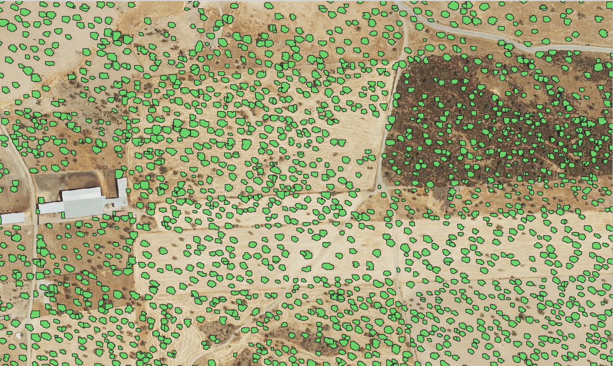
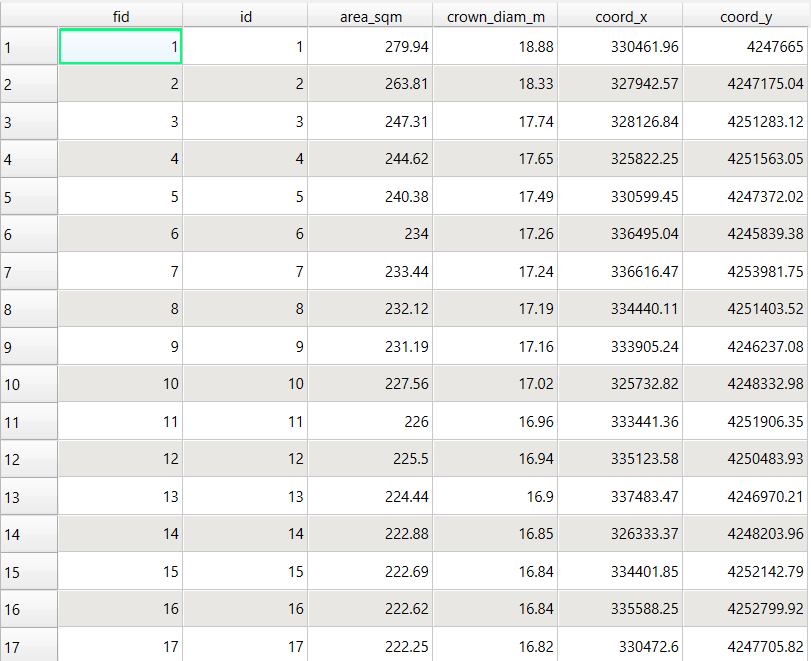
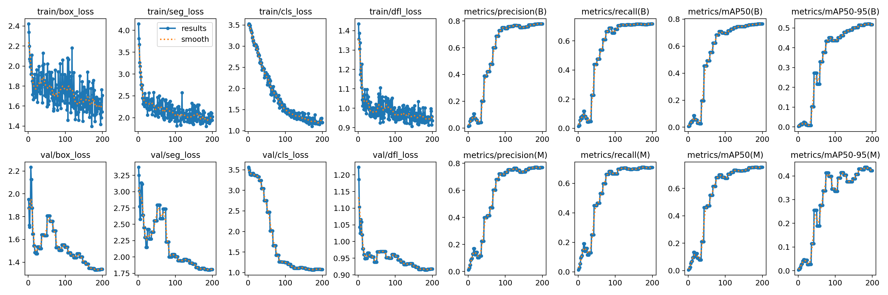
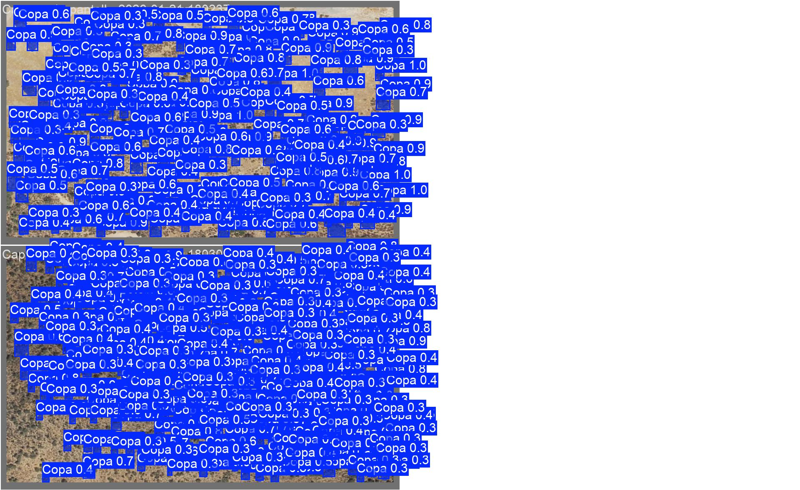

# Dehesa Tree Crown Segmentation (YOLOv11)


[](https://github.com/Juanmaherruzo/annotation_station/tree/main)

Instance segmentation of individual tree crowns in Mediterranean Dehesa ecosystems. Processes large aerial orthophotos tile-by-tile and exports georeferenced crown polygons to GeoPackage for direct use in QGIS or ArcGIS.



---

## Features

| Capability | Description |
| :--- | :--- |
| **Out-of-core tiling** | Sliding-window sampler handles orthophotos of any size without loading the full image into RAM |
| **Instance segmentation** | YOLOv11n-seg produces a pixel-level mask for each individual crown |
| **Georeferencing** | Affine transform maps pixel masks to real-world CRS polygons, preserving the raster's coordinate reference system |
| **Spatial NMS** | Vectorised IoU-based duplicate suppression across tile boundaries using geopandas spatial join |
| **Per-tree biometrics** | Crown area (m²), estimated diameter (m), centroid coordinates (X/Y) |
| **Stand-level metrics** | Tree density (stems/ha), Fractional Canopy Cover (%), diameter statistics |
| **GIS export** | GeoPackage (.gpkg) compatible with QGIS and ArcGIS |

---

## How It Works

```
Orthophoto (.tif)
      │
      ▼
 TilingSampler ──► 960×960 px windows (configurable overlap)
      │
      ▼
 CrownDetectionEngine  ←── YOLOv11n-seg weights
      │  per tile: read → infer → mask-to-polygon (affine)
      │  parallel threads, each with its own rasterio handle
      │
      ▼
 Vectorised NMS  (spatial join + IoU threshold)
      │
      ▼
 InventoryReporter
      ├── diameter filter
      ├── forest statistics
      └── GeoPackage export
```

---

## Installation

**1. Clone**
```bash
git clone https://github.com/Juanmaherruzo/Dehesa-Crown-Segmentation-YOLOv11.git
cd Dehesa-Crown-Segmentation-YOLOv11
```

**2. Install PyTorch** (match your CUDA version — check with `nvidia-smi`)
```bash
# CUDA 12.6
pip install torch torchvision torchaudio --index-url https://download.pytorch.org/whl/cu126
# CPU only
pip install torch torchvision torchaudio
```

**3. Install the package** (dependencies come from `pyproject.toml`)
```bash
pip install -e ".[dev]"
# or, faster, with uv:
uv venv && uv pip install -e ".[dev]"
```

---

## Usage

Installing the package exposes two console commands:

```bash
# Detect crowns in an orthophoto and export a GeoPackage
crown-detect --image orthophoto.tif --model models/best.pt --output crowns.gpkg

# Sample multispectral index values (NDVI, EVI, ...) at each crown centroid
crown-indices --gpkg crowns.gpkg --index-dir ./indices
```

Key `crown-detect` options and their effect:

| Flag | Default | Notes |
| :--- | :---: | :--- |
| `--tile-size` | `960` | Must match the model training image size |
| `--overlap` | `200` | Larger overlap → fewer missed edge crowns, more NMS work |
| `--conf` | `0.50` | Lower → more detections, more false positives |
| `--nms-iou` | `0.40` | IoU above this → duplicate, keep the larger polygon |
| `--min-diameter` | `3.0` | Hard filter: discard crowns narrower than this (m) |
| `--workers` | `-1` | Parallel threads (`-1` = one per core, capped at 2 on CUDA) |

These defaults are read from `CrownDetectionEngine`, so the library and the CLI
cannot drift apart; a test asserts it.

**On workers and VRAM.** Each worker thread builds its own YOLO predictor,
because an Ultralytics model is not safe to call concurrently from several
threads. On CUDA that means one copy of the weights per worker, so `-1` is
capped at 2 to keep a 4 GB laptop GPU inside its budget. Raise it explicitly
(`--workers 4`) if you have the memory.

**On completeness.** A tile that fails is counted, logged at `WARNING`, and
reported in the inventory summary as a coverage percentage; `crown-detect` exits
non-zero if any tile was lost. A stem count from a run that dropped tiles is a
lower bound, and the tool says so rather than reporting success.

---

## Output

The exported GeoPackage contains one polygon per detected crown:



| Column | Type | Description |
| :--- | :--- | :--- |
| `id` | Integer | Sequential tree identifier |
| `area_sqm` | Float | Crown area in m² |
| `crown_diam_m` | Float | Estimated diameter: 2 · √(area / π) |
| `coord_x` | Float | Centroid X in raster CRS units |
| `coord_y` | Float | Centroid Y in raster CRS units |
| `geometry` | Polygon | Georeferenced crown polygon in raster CRS |

---

## Results

Two different things are reported below, and they should not be conflated: what
the model *scores* against annotated ground truth, and what it *produced* when
run over a large orthophoto. Only the first is a measure of accuracy.

### Model accuracy — validation split · 200 epochs · `yolo11n-seg` · 960 px



| Metric | Box | Mask |
| :--- | :---: | :---: |
| **Precision** | 77.9 % | 76.9 % |
| **Recall** | 71.8 % | 70.9 % |
| **mAP@50** | 76.6 % | 75.5 % |
| **mAP@50-95** | 51.6 % | 42.3 % |

These are **validation-split figures** — the same split used to select the
checkpoint — not an independent test set, so read them as an optimistic estimate.
A mask mAP@50-95 of 42.3 % is modest: see *Known Limitations*.



### Inventory output — 14,506 ha study area · 25 cm/px GSD

The run below is an **inference output, not a validation**: there is no
ground-truth stem count for these 14,506 ha, so the figures describe what the
model produced, not how right it was. Accuracy is the table above.

| Metric | Value |
| :--- | :--- |
| **Detected stems** | 357,185 |
| **Tree density** | 24.62 stems/ha |
| **Canopy Cover (FCC)** | 11.48 % |
| **Mean crown diameter** | 7.35 m |
| **Std dev (diameter)** | 2.30 m |
| **Median crown diameter** | 7.16 m |
| **Max crown diameter** | 18.88 m |

The figures are internally consistent: 24.62 stems/ha at a 7.35 m mean crown
diameter implies ~10.5 % cover, against the 11.48 % measured from the polygons.
Given a mask recall of 70.9 %, the true stem count is very likely **higher** than
357,185; treat it as a lower bound rather than a census.

---

## Known Limitations

- **Geographic scope** — Trained on Dehesa *encinar* (holm oak) landscapes in southwestern Spain. Performance on other forest types, species compositions, or regions has not been validated.
- **Resolution dependency** — Optimised for 25 cm/px GSD at 960 px tile size. Results may degrade at significantly different ground sampling distances.
- **Single class** — Detects one class (`Copa`). Does not distinguish species, health status, or age class.
- **Dense canopy** — Heavy crown overlap may produce merged or missed detections.
- **Model scale** — Uses the `Nano` variant (`yolo11n-seg`) for speed. Larger YOLO variants are expected to improve recall in structurally complex scenes.
- **Low accuracy** — Performance metrics fall significantly below the expected baseline for a segmentation project. To achieve improvements, greater volume and variance in the training data are required.
- **No independent test set** — Reported metrics come from the validation split used for model selection, so they are an optimistic estimate of performance on unseen data.
- **No field validation** — The 14,506 ha inventory has never been checked against ground-truth stem counts or field plots. It is a model output, not a verified census.

---

## Contributing

Contributions are welcome. Areas of particular interest:

- Models trained on larger or more diverse Dehesa datasets
- Multi-species or health-status classification
- Lightweight inference path for field / CPU-only deployment

Please open an issue or submit a pull request.

---
## Citation

If you use this work in your research, please cite:

```bibtex
@software{herruzo2026dehesacrowns,
  author = {Herruzo, Juan Manuel},
  title  = {Dehesa Tree Crown Segmentation (YOLOv11)},
  year   = {2026},
  url    = {https://github.com/Juanmaherruzo/Dehesa-Crown-Segmentation-YOLOv11}
}
```

---

## Contact
**Juan Manuel Herruzo**  
juanmherruzo@gmail.com

---

## License

Code: **MIT License** — see [LICENSE](LICENSE).  
